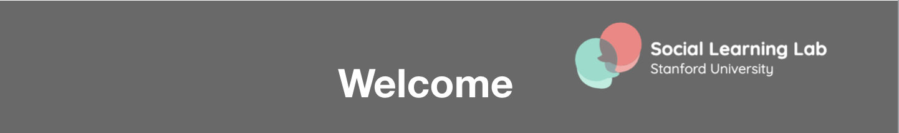

# Online Testing: Startup Guide and Materials
Contributors: Hyowon Gweon, Xi Jia Zhou, Jessa Stegall, Brandon Carrillo, Megan Merrick, Stephen Sanders, Natalia Velez, Sophie Bridgers, and other members of the Social Learning Lab at Stanford University

## License
<a rel="license" href="http://creativecommons.org/licenses/by-nc/4.0/"></a><br />This work is licensed under a <a rel="license" href="http://creativecommons.org/licenses/by-nc/4.0/">Creative Commons Attribution-NonCommercial 4.0 International License</a>.

This is a repository to share Stanford Social Learning Lab's online testing procedure and materials. 
These materials are developed by members of the Social Learning Lab (PI: Hyowon Gweon). We are particularly grateful to our students/post-docs (Mika Asaba, Sophie Bridgers, Aaron Chuey, Griffin Dietz, Yang Wu, and Natalia Vélez) and lab staff who played critical roles (Brandon Carrillo, Megan Merrick, Jessa Stegall, and Xijia Zhou. 

Materials in this repository are licensed (CC-BY-NC); what this means is that you are free to modify or revise the materials as you see fit for your lab, as long as you credit the original source in any resulting publications. To cite our materials, you can use this DOI: [insert]. e.g., 

```
@misc{online_testing,
    author       = {Social Learning Lab},
    title        = {{Online Testing: Startup Guide and Materials}},
    month        = apr,
    year         = 2020,
    doi          = {doi_goes_here},
    version      = {1.0},
    publisher    = {Zenodo},
    url          = {doi_url_goes_here}
    }
```

TODO: CHECK CITATION

## What is this guide for?

The procedure and materials developed here are suitable for labs who plan to run scheduled video chats using Zoom. The goal is to recreate the in-person testing experience as much as possible.

We recently launched Parent Researcher Collaborative: [ChildrenHelpingScience.com](https://childrenhelpingscience.com/), a collective effort to test children online from around the world. If you are developing your own online studies, come join us! You can find more information on how to add your study [here](https://childrenhelpingscience.com/add-study). 
 
## Startup guide

### Downloading this repository

You can clone this repository ([instructions](https://help.github.com/en/github/creating-cloning-and-archiving-repositories/cloning-a-repository)) or download it as a zip file by clicking the 'Download' button at the top of this page: <br>


### Online testing demo

Please watch these videos for a demonstration of what an online testing session looks like:

* [Experimenter's point of view](link_to_file)
* [Parent's point of view](link_to_file)

The boilerplate used in this study session (consenting, video calibration, feedback questions) and virtual background used by the experimenter can be downloaded from the [`on_test_day` folder](https://github.com/sociallearninglab/online_testing_materials/tree/master/On_test_day).

### Materials

The contents of this repository are organized chronologically: We have included materials to recruit and schedule participants *before testing* (`before_test_day`), to use *during testing* (`on_test_day`), and to follow up with participants after testing (`after_test_day`). Click through the repository or any of the quick links in the Table of Contents to check out individual files. All materials are provided in their original form when possible (e.g., Keynote presentations) for your convenience to edit and reuse in your own studies. We will update testing materials in this repository periodically.

### Online testing checklist

Before testing:

  1. Lab IRB. 
  2. Set up Zoom: <br>
    a) Researcher Instruction Guide. (See [ours](https://github.com/sociallearninglab/online_testing_materials/blob/master/Before_test_day/Lab%20Testing%20Online%20Prep%20Guide.key)) <br>
    b) Use a consistent virtual background. (Example [here](https://github.com/sociallearninglab/online_testing_materials/blob/master/Before_test_day/virtual_background.jpg))
  3. Recruiting parents: <br>
    a) Recruitment Poster. (See [ours](https://github.com/sociallearninglab/online_testing_materials/blob/master/Before_test_day/SLL%20Participation%20Flyer.pdf)) <br>
    b) Email templates.   
    c) Parent Instruction guide. (See [ours](https://github.com/sociallearninglab/online_testing_materials/blob/master/Before_test_day/parent_instruction_guide.key)) 

During the testing session:

  1. Rapport with children; Introduce the study to parents (like in-person testing).
  2. Lab standardized calibration slides & sound check (with a short video clip of your choice). (See [ours](https://github.com/sociallearninglab/online_testing_materials/blob/master/On_test_day/Calibration_Part1.key))
  3. Parental Consent. (See [ours](https://github.com/sociallearninglab/online_testing_materials/blob/master/On_test_day/Parental_Consent.key))
  4. Study specific video screen calibration slide (researchers can self-adjust). (See [ours](https://github.com/sociallearninglab/online_testing_materials/blob/master/On_test_day/Calibration_Part2.key))
  5. Children Assent + study slides (like in-person testing).
  6. Feedback slides for testing. (See [ours](https://github.com/sociallearninglab/online_testing_materials/blob/master/On_test_day/Feedback_Slides.key))
     (You can also use this shortened version). (See [ours](https://github.com/sociallearninglab/online_testing_materials/blob/master/On_test_day/Shortened_Follow_Up.key))

After testing:

  1. Certificates for children. (See [ours](https://github.com/sociallearninglab/online_testing_materials/blob/master/After_test_day/Online%20Testing%20Certificate.pdf))
  2. Data log-in.

## Attribution
<p>
Images in introduction slides and parent instruction guide: <a href="https://www.freepik.com/free-photos-vectors/book">Book vector created by freepik - www.freepik.com</a> <br>
Images in recruitment poster: <a href="https://www.canva.com"> Canva - www.canva.com</a> <br>
</p>
